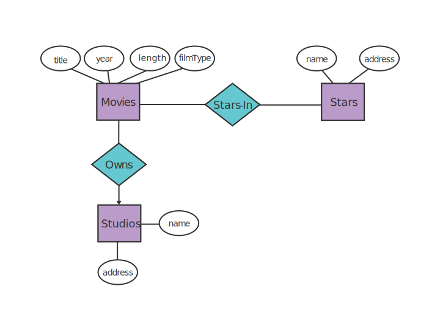

# Entity Relationship Model

**Lecture 2 - January 6, 2017**

_definition:_ The **Entity Relationship Model** is a notation for expressing database designs.

In the database both *entities* and *relationships* will be translated to *relations* (tables).

#### Example

We can represent a database for movies as follows,

In this diagram,

* **Squares** represent entities.
* **Circles** represent attributes.
* **Diamonds** represent relations.
* **Arrows** represent a singular relations.

So **one** studio *owns* **many** movies.
