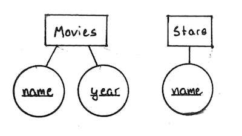

# Entity Relationship Model

_definition:_ The **Entity Relationship Model** is a notation for expressing database designs.

In the database both *entities* and *relationships* will be translated to *relations* (tables).

#### Example

We can represent a database for movies as follows,

In this diagram,

* **Squares** represent entities.
* **Circles** represent attributes.
* **Diamonds** represent relations.
* **Arrows** represent a singular relations.

So **one** studio *owns* **many** movies.

## Keys

_definition_: A **key** is an attribute, or a set of attributes, such that no two entities have the same key.

In Entity-Relationship diagrams we *underline* the keys,

### Surrogate Keys

_definition_: A **surrogate key** is a unique identifier which only serves to be the key for an entity. For example a student number or Social Insurance Number (SIN) is a surrogate key.

### Rules

An entity set should satisfy one of the following

1. It's more then the name of something, i.e., it has a non-key attribute.
2. It's the "many" side in a relationship.

#### Example

Give an E/R diagram for a database recording information about teams, players, and their fans, including:

1. For each team, its name, its players, its team captain (one of its players), and the colors of its uniform.
2. For each player, his/her name.
3. For each fan, his/her name, favorite teams, favorite players, and favorite color.

#### Solution

## Subclasses

_definition_: Sometimes in an entity set or class you have have different types of that entity set, **subclasses**.

### Weak Entity Sets

_definition_: An entity set is said to be **"weak"** if we need to follow one or more *many-to-one* relationships to uniquely identify the entity set.

A [surrogate key](#surrogate-keys) can be used to avoid creating weak entity sets.

#### Example

For football players `name` and `number` are not enough to identify them (since two players *could* have the same name and the same player number), so require the teams `name`, related by `plays-on` to uniquely identify them.
