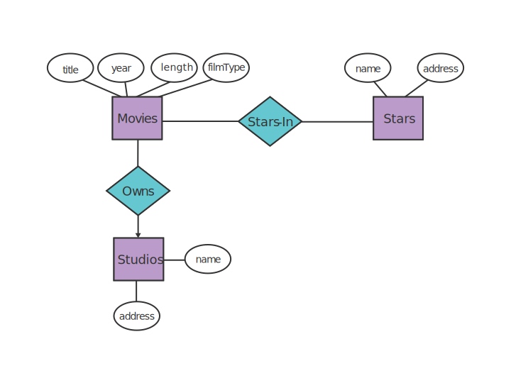
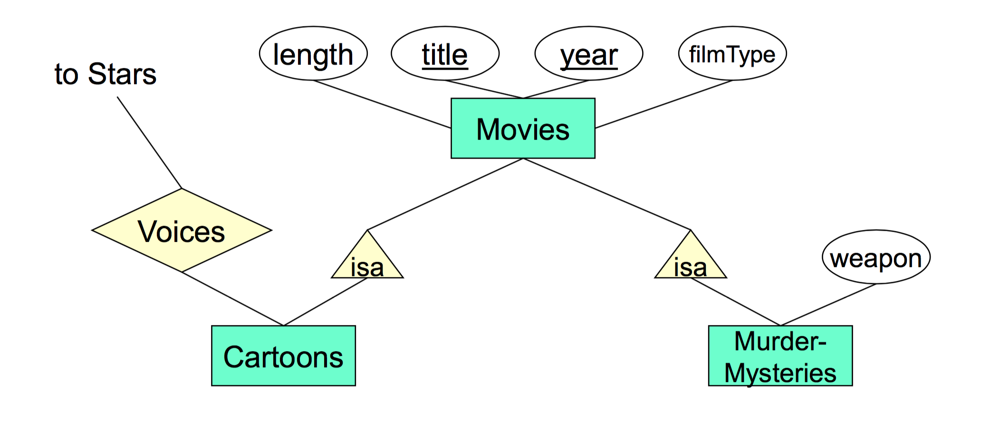

# E/R Diagrams to Relations 

## Table Terminology

In a table

* *Headings* are **attribute names**.
* *Rows* are **tuples**.
* *Elements* in rows are tuple components

## Entity Sets to Relations

#### Example

The tables are,

* `Movies`: (_`title`_, `year`, `length`, `filmType`, `studioName`) 
* `Studios`: (_`name`_, `address`)
* `Stars`: (_`name`_, `address`)
* `StarsIn`: (_`title`_, `year`, `starName`)

The `movies` table would look like,

`title` | `year` | `length` | `filmType` | `studioName`
:-:|:-:|:-:|:-:|:-:
`Godzilla` | `2014` | `200` | `feature` | `Fox`
... | ... | ... | ... | ...

## `isa` Relationships

We can use `isa` relationships to show inheritance relations.

We use two approaches to 

### Object-Oriented Approach

In the **Object-Oriented (OO)** approach, every subclass has it's own relation. For the example above we have the following tables

* `Movies(title, year, length, filmType)`
* `Cartoons(title, year, length, filmType)`
* `MurderMysteries(title, year, length, filmType, weapon)`
* `Cartoon-MurderMysteries(title, year, length, filmType, weapon)`
* `Voices(title, year, starName)`

**Issue**: This approach requires many tables to implement, specifically if we have a root and $n$ children we require $2^n$ tables.

### Entity/Relationship Approach

In the **Entity-Relationship** approach, which is most common, the example above has the following tables

* `Movies(title, year, length, filmType)`
* `MurderMystery(title, year, weapon)`
* `Cartoons(title, year)`
* `Voices(title, year, name)`

**Issue**: We must do several table lookups to get the information for a single object. For example if we want the `length` and `weapon` for a murder mystery we have to look in `Movies` and `MurderMystery`.
